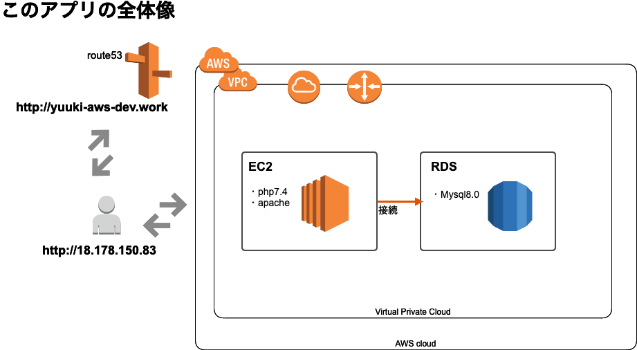

## イベント管理アップの概要
* アプリURL: yuuki-aws-dev.work
* 言語: PHP(version7.4)
    * バックエンドの基礎知識を深めたかった為フレームワークではなく、素のphpを選定。
* sql: mysql(version8.0)

### インフラ周りの設定図

### 実装でこだわった部分
* MVC設計
* CRUD機能
* バリデーション実装
* db接続情報や環境の判定を隠しファイルに設定することで情報漏洩防止とデプロイの利便性向上

### 躓いた部分
* 最初dockerでlocal環境を作っていたが、本番環境のECSにデプロイするところで躓いてしまった
* composerのバージョンが本番とローカルで違い、なかなか同じ動作にならなかった

### 今後実装加える部分
* Unittest
* ~~login機能(mail送信を実装)~~ 4/28実装

| mail | pass |
|:-----------:|:------------:|
| dummy@gmail.com       | dummy1234        | 

* マークダウン機能
* セキュリティー対策をする(CSRF, XSSなど)
